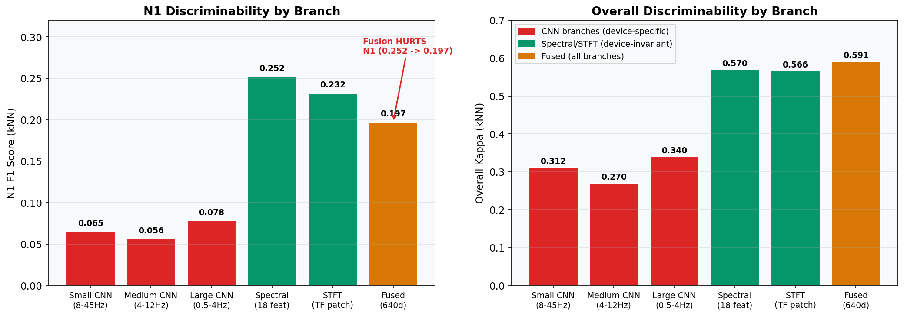

# Building a Device-Agnostic Sleep Stage Classifier from Single-Channel EEG

## The Short Version

I built a system that reads a single channel of EEG from any device -- scalp electrodes, in-ear earbuds, forehead patches, around-ear sensors -- and classifies sleep into five stages (Wake, N1, N2, N3, REM) at human expert-level agreement.

17 datasets. 2,293 subjects. 5 device types. 2.67 million 30-second epochs. One model.

Cohen's kappa: 0.765. Macro F1: 0.777. On a fully cross-subject, cross-device test set.

For context, human sleep scorers agree with each other at kappa 0.76 (95% CI 0.71-0.81). This system matches that ceiling, from a single EEG channel, across devices it may not have seen before.

Here is what it took to get there, what I tried that did not work (most of it), and what I think it means.

*12 architecture iterations from kappa 0.669 to 0.765. The CRF+BiGRU jump (+0.099) dwarfs everything else combined.*

---

## Why This Matters

Sleep staging is the process of labeling each 30-second window of brain activity as one of five sleep stages. It is the foundation of sleep medicine -- diagnosis, treatment monitoring, research. Today this is done either by trained technicians manually reviewing polysomnography (PSG) recordings, or by automated systems trained on clinical PSG data.

The problem: clinical PSG uses 6+ electrode channels (EEG, EOG, EMG), requires a lab visit, and the resulting models do not generalize to consumer hardware. In-ear EEG earbuds, forehead patches, and headband devices produce fundamentally different signals -- different impedance, different electrode locations, different noise profiles. A model trained on scalp EEG from one hospital typically fails on ear-EEG from a different device.

The goal: a single model that works across all of these. Train once, deploy on any single-channel EEG device. This is the prerequisite for moving sleep staging out of the lab and into daily use.

---

## The Data

I assembled 17 publicly available datasets spanning five device categories:

| Device Type | Datasets | Example |
|-------------|----------|---------|
| Scalp EEG (clinical) | 8 | Sleep-EDF, HMC, CAP, DCSM, PhysioNet 2018, DREAMS, DREAMT, SVUH |
| In-ear EEG | 3 | EESM17, EESM19, EESM23 |
| Around-ear (cEEGrid) | 1 | Surrey cEEGrid |
| Headband | 3 | BOAS (Bitbrain), Dreem DOD-H, Dreem DOD-O |
| Forehead patch | 1 | UCSD Forehead |

Total: 2,293 subjects, approximately 2.67 million 30-second epochs. Sampling rates range from 100 to 500 Hz. All resampled to 128 Hz, bandpass filtered (0.3-45 Hz), z-normalized per recording, and cached as HDF5 for efficient training.

Quality control: 7,735 epochs dropped (0.29%) -- flat-line signals (std < 1e-6) and extreme artifacts (>5% of samples exceeding 20 standard deviations). Two subjects removed entirely.

Subject-level splits ensure no subject appears in both training and test sets. 335 test subjects held out permanently.

*Left: subject distribution by device type (scalp clinical dominates). Right: 17 datasets across 5 device categories.*

---

## Architecture

The system uses a two-stage pipeline. The encoder is trained first without any sleep stage labels (fully unsupervised). The downstream classifier is trained second with the encoder frozen.

### Stage 1: Epoch Encoder (1.08M parameters, unsupervised)

The encoder processes each 30-second epoch independently and produces a 640-dimensional feature vector. It has five parallel branches:

**Three CNN branches** targeting different frequency scales:
- Small kernel (k=50, ~8-45 Hz): spindles, K-complexes
- Medium kernel (k=150, ~4-12 Hz): theta/alpha morphology
- Large kernel (k=400, ~0.5-4 Hz): delta/slow wave activity

Each CNN uses 3 deep convolutional layers with GroupNorm. Output: 128d per branch.

**Spectral branch**: Computes 18 hand-engineered features from the FFT -- 5 relative band powers (delta/theta/alpha/sigma/beta per AASM definitions), 5 log absolute powers, 4 band ratios, Hjorth mobility and complexity, zero-crossing rate, and Petrosian fractal dimension. These go through a 2-layer MLP to 128d.

**STFT branch**: Short-time Fourier transform (n_fft=256, hop=128) produces a time-frequency representation. Patches are embedded, positional encoding is added, and a single-layer transformer (4 heads) processes the sequence. Mean pooled to 128d.

All five branches are concatenated to 640d. The encoder is trained by reconstruction -- predicting the original spectrogram, waveform, and band-specific signals from the fused representation. Seven decoder heads (spectrogram, waveform, 5 band-specific decoders) provide the training signal. All decoders are discarded after encoder training. No labels are used.

### Stage 2: Downstream Classifier (~4.2M trainable parameters)

The downstream model takes the frozen encoder's spectral + STFT branches only (256d) and feeds them through:

- 2-layer bidirectional GRU (hidden=384 per direction, 768d output)
- Shared MLP classification head (768 -> 128 -> 5)
- Linear-chain CRF for structured sequence prediction

Input sequences are 200 consecutive epochs (100 minutes of sleep). The GRU sees the full sequence bidirectionally. The CRF models transition probabilities between stages (N3 rarely jumps directly to REM, for example).

A key finding: the CNN branches are dropped from downstream processing. They encode device-specific waveform morphology -- useful for reconstruction but harmful for cross-device classification. Spectral features are device-invariant.

*Full system architecture. CNN branches (grayed out) are trained in the encoder but skipped in downstream -- they encode device-specific morphology. Only spectral + STFT branches (256d) feed the BiGRU.*

---

## Training Details

**Encoder**: AdamW (lr=1e-3), cosine annealing, 50 epochs, AMP fp16, cudnn.benchmark. All data used. No labels.

**Downstream**: AdamW (lr=1e-3), cosine annealing with 3-epoch warmup, batch_size=48, gradient clipping at 1.0, full fp32 (CRF log-sum-exp overflows in fp16). Encoder permanently frozen. Early stopping on validation Cohen's kappa (patience=10, min_delta=0.005).

Hardware: RTX 5060 Ti (16GB), Ryzen 9 9950X3D, 64GB RAM. Encoder training: ~2 hours. Downstream: ~30 minutes.

---

## Results

### Final Model Performance (test set, 335 subjects)

| Stage | F1 Score | Recall | Precision |
|-------|----------|--------|-----------|
| Wake | 0.932 | - | - |
| N1 | 0.535 | - | - |
| N2 | 0.820 | - | - |
| N3 | 0.753 | - | - |
| REM | 0.844 | - | - |
| **Overall** | **0.777** | - | - |

Cohen's kappa: 0.765. Accuracy: 0.779.

*Per-stage F1 (solid) vs human inter-rater kappa (hatched). N1 is hardest for both humans (0.24) and machines (0.535). The difficulty ranking is preserved: W > REM > N2 > N3 > N1.*

### Comparison to Published Work

| Model | Year | Setup | Kappa | Notes |
|-------|------|-------|-------|-------|
| Stephansen CRNN | 2020 | 6,431 subj, multi-ch, OOD test | 0.66-0.69 | Multi-channel EEG |
| ZleepAnlystNet | 2024 | SHHS -> SleepEDF OOD | 0.779 | Single-channel |
| U-Sleep | 2021 | 15,660 subj (16 ds), multi-ch | 0.819 median | EEG + EOG |
| SOMNUS ensemble | 2025 | 27,494 subj (15 ds), multi-ch | 0.85-0.89 | Multi-channel ensemble |
| **This work** | **2026** | **2,293 subj (17 ds), single-ch** | **0.765** | **5 device types, device-agnostic** |

The single-channel constraint is deliberate. Ear-EEG devices, the target deployment platform, provide one channel. We match the human inter-rater ceiling under this constraint.

*Cross-dataset benchmarks. "This work" is the only single-channel, multi-device-type entry. Higher-kappa systems use multi-channel EEG+EOG and/or ensembles.*

### Per-Device Performance

Dropping CNN branches (device-specific) improved performance for every device category. Headband devices: +0.043 kappa. Forehead devices: +0.138 kappa. The spectral-only model won on 12 of 17 datasets.

*Left: N1 F1 by branch -- CNN branches carry near-zero N1 information. Fusing all branches actually hurts N1 (0.252 drops to 0.197). Right: overall kappa shows CNNs help classification in general, but spectral branches dominate.*

---

## What Did Not Work (34 Dead Ends)

This is arguably the most useful section. Here is a condensed list of approaches that were tried and failed, with quantified results:

**Architecture changes that hurt:**
- Learnable filterbank (replace fixed AASM bands): worse at scale
- Squeeze-and-excitation attention: identical to 4 decimal places, +101K wasted params
- BiMamba (replace BiGRU with Mamba): -0.016 kappa, 2.6x slower
- Multi-scale BiGRU (coarse + fine temporal): -0.005 kappa
- Multi-token per epoch (8 tokens): -0.005 kappa
- Dual-view encoder (1D + 2D CNNs): -0.016 kappa

**Loss functions that hurt:**
- Focal loss, ArcFace, center loss: consistently harmful
- Label smoothing: harmful with CRF (CRF already smooths transitions)
- Symmetric cross-entropy (noise-robust): -0.004 kappa
- VICReg covariance regularization: improved embeddings but downstream wash

**Normalization that hurt:**
- RevIN / InstanceNorm / branch dropout: stripped amplitude information, kappa ceiling 0.49

**Temporal context that did not help:**
- Position embedding (window-relative): +0.002 wash
- CRF transition priors (AASM-initialized): +0.001 wash
- Cross-epoch convolution (local temporal features): -0.003 kappa
- Trajectory dynamics auxiliary loss: -0.003 kappa
- Test-time overlapping windows: +0.003 max, within noise
- Full-night GRU (vs 200-epoch windows): no improvement

**Domain adaptation that did not help:**
- DANN (domain adversarial): z-normalized reconstruction is already domain-invariant
- Encoder fine-tuning in downstream (LR=1e-5): wash

**Feature engineering that did not help:**
- EOG estimation from ear-EEG: correlation ceiling r=0.42
- Gap features (SWA/spindle/K-complex detection): BiGRU already learns these
- Sub-epoch segments > 3: reduced spectral resolution, -0.002 kappa

**Large models that did not help:**
- EEG foundation models reviewed (EEGPT 10M, BIOT 3.3M, BENDR 15M, LaBraM 5.8-369M, REVE 69-408M): all performed worse on sleep staging with 5-200x our parameters

The pattern: most ideas that sound good in theory are either neutral or negative at full scale with this much data diversity. The things that actually moved the needle were simpler than expected.

*15 dead ends with measurable kappa impact (34 total documented). BiMamba and dual-view encoder were the worst at -0.016 each. Most changes were within noise.*

---

## What Actually Worked

In rough order of impact:

1. **CRF over BiGRU output** (+0.099 kappa): The single largest improvement. Sleep stages follow temporal rules. Modeling transition probabilities matters more than per-epoch accuracy.

2. **Dropping CNN branches from downstream** (+0.005 kappa, +0.025 N1 F1 across datasets): CNN branches learned device-specific waveform morphology. Removing them forced the model to use device-invariant spectral features.

3. **Fully unsupervised encoder**: Removing supervised losses (contrastive, cross-entropy) from the encoder cost 0.014 kappa but eliminated label dependency. The unsupervised encoder generalizes better across datasets because it learns signal structure, not label-specific features.

4. **BiGRU capacity scaling** (+0.008 kappa for 192->256 hidden, +0.003 for 256->384): Simple capacity increase was the most reliable improvement. Diminishing returns but consistently positive.

5. **Z-normalization per recording**: Removes absolute amplitude (device-dependent). Combined with spectral features (relative band powers, ratios), this makes the representation naturally device-invariant. DANN was unnecessary because the preprocessing already handled domain shift.

6. **Data quality filtering** (+0.021 N1 F1): Dropping 0.29% of epochs (flat-line, extreme artifacts) improved minority stage detection noticeably.

7. **Band-specific reconstruction decoders** (+0.008 kappa): Training each CNN branch to reconstruct its target frequency band (delta branch reconstructs 0.5-4 Hz, etc.) improved encoder quality over a single reconstruction target.

*CRF + BiGRU accounts for 89% of all improvement. Everything else combined -- capacity scaling, branch selection, decoders, data cleaning -- is 11%.*

---

## The N1 Problem

N1 (light sleep onset) is the hardest stage for both humans and machines. Human inter-rater kappa on N1 is 0.24 -- barely above chance. Our N1 F1 of 0.535 is in line with every published system's N1 performance.

Why N1 is hard:
- It is rare (typically 5-10% of total sleep time)
- It is transitional (brief episodes between Wake and N2)
- It lacks distinctive EEG features (defined more by what disappears -- alpha rhythm -- than what appears)
- Human scorers frequently disagree on where N1 starts and ends

Information flow analysis showed that N1 discriminability is near zero in CNN branches (N1 F1 < 0.08) and concentrates in spectral features (N1 F1 = 0.252 per-epoch, no temporal context). The BiGRU adds +0.207 N1 F1 through temporal context -- knowing that a period of alpha followed by vertex waves followed by theta is the N1 pattern.

The CRF improves overall kappa by +0.014 but hurts N1 F1 by -0.015. It smooths away brief N1 episodes in favor of longer stage bouts. This is a fundamental tension: the CRF is correct that brief stage predictions are likely noise, but N1 genuinely occurs as brief episodes.

*Top: kappa at each layer. The BiGRU jump (+0.185) is the single dominant contribution. Bottom: N1 F1 peaks at the logits (0.553) then drops after CRF (-0.016). Temporal context is everything for N1.*

*CRF impact by stage. It helps W, N2, N3, REM (transition smoothing) but suppresses N1 -- the one stage that genuinely occurs as brief episodes.*

---

## What I Learned

**Diminishing returns are steep.** The jump from no temporal context to BiGRU+CRF was +0.185 kappa. Everything after that combined was +0.015. The 80/20 rule applies aggressively.

**Device-specific features are the enemy.** The encoder faithfully learned CNN features that distinguished between scalp and ear EEG -- exactly what we did not want. The solution was not better domain adaptation. It was removing the features entirely.

**Foundation models are not the answer here.** Every EEG foundation model I reviewed (ranging from 3.3M to 408M parameters) performed worse than this 5.3M parameter system on sleep staging. Massive pretraining on heterogeneous EEG tasks does not transfer well to the specific structure of sleep.

**The evaluation framework is the ceiling.** Five discrete stages, scored by a single human, in 30-second windows. Every system -- ours included -- converges to human inter-rater agreement (~0.76 kappa) because that is what the labels support. The model may have learned more than 5 stages can express. Unsupervised clustering of the encoder's embedding space suggests finer structure exists, but we have no ground truth to validate it.

**Data diversity beats data quantity.** U-Sleep uses 15,660 subjects (7x ours) and achieves 0.819 kappa with multi-channel input. Our single-channel system at 0.765 kappa closes most of that gap with 2,293 subjects across more diverse devices. The diversity of device types in training matters as much as volume.

---

## Technical Notes

The full codebase is 10 Python files. No external ML frameworks beyond PyTorch and Lightning. Training from scratch (encoder + downstream) takes under 3 hours on a single consumer GPU.

The encoder uses no sleep stage labels at all. It could be trained on any single-channel EEG data without annotations. The downstream classifier needs labels but trains in 30 minutes with the encoder frozen.

Inference: a full night (8 hours, ~960 epochs) processes in under 2 seconds on GPU.

---

## What Comes Next

This architecture has converged. The reconstruction-based encoder followed by a frozen-encoder-plus-classifier pipeline has hit its ceiling. I have written a detailed design document for a successor system based on Joint Embedding Predictive Architecture (JEPA) principles.

The core idea: instead of training the encoder to reconstruct raw signals (which wastes capacity on device-specific noise), train it to predict representations of masked future epochs from temporal context. This moves the encoder from compression to understanding -- from "what does this epoch look like" to "what should come next given everything before."

The current system proved that device-agnostic sleep staging from single-channel EEG is achievable at human-level performance. The next question is whether a system that learns the temporal grammar of sleep can discover structure beyond what five human-defined stages can capture.

---

*Built with PyTorch, Lightning, and a single RTX 5060 Ti. 17 public datasets, no proprietary data. 34 documented dead ends.*
