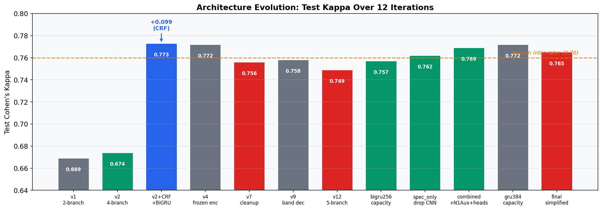
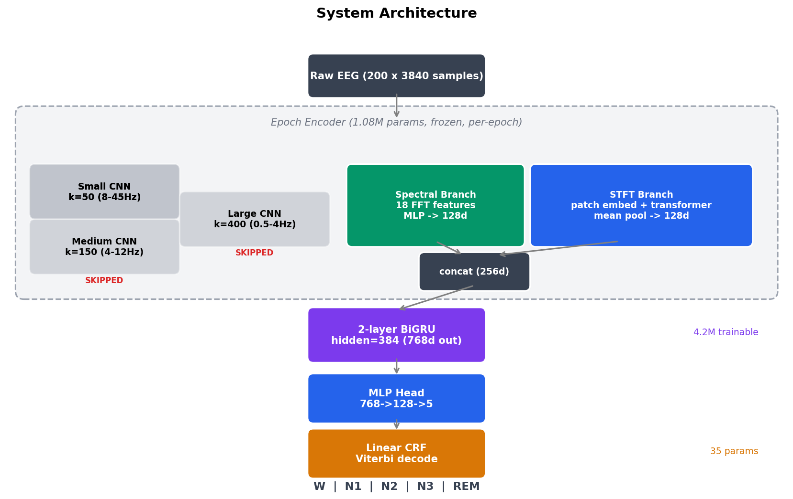
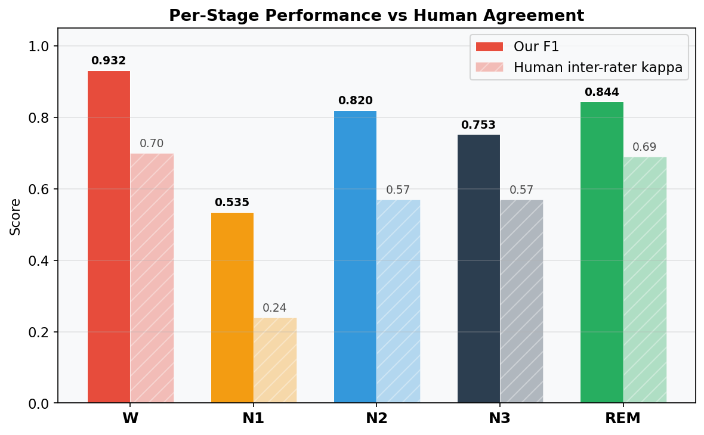
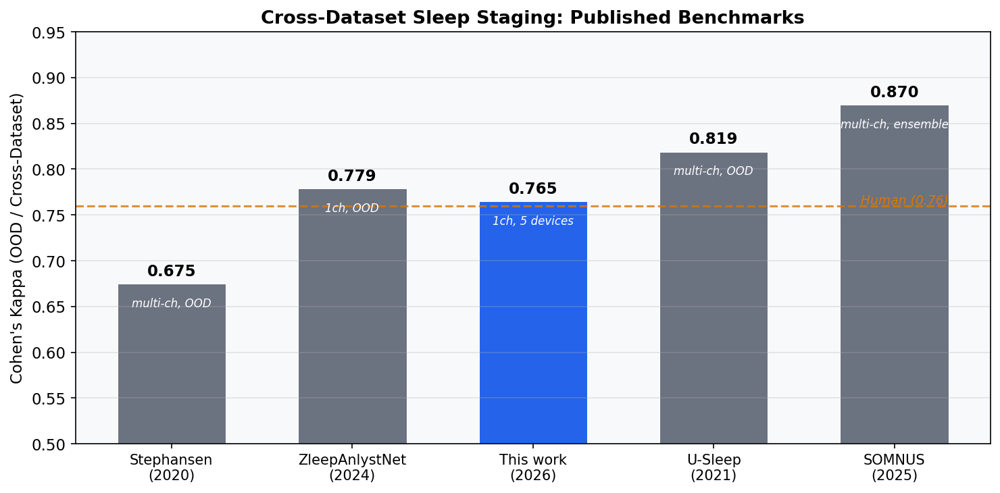
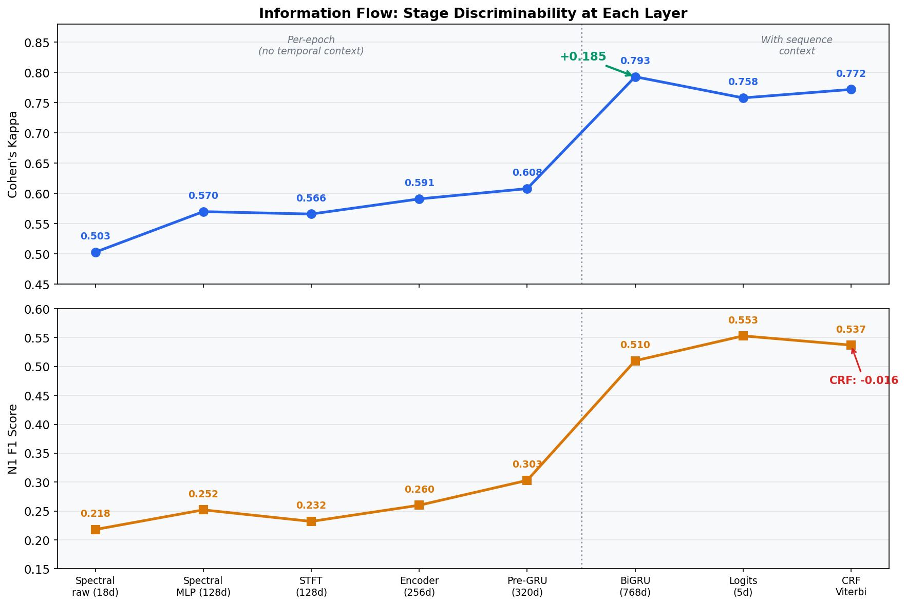
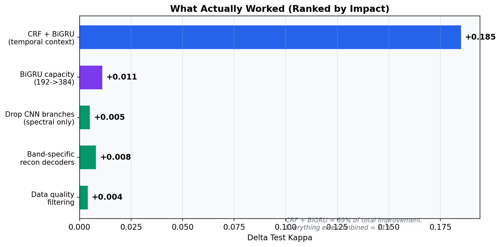
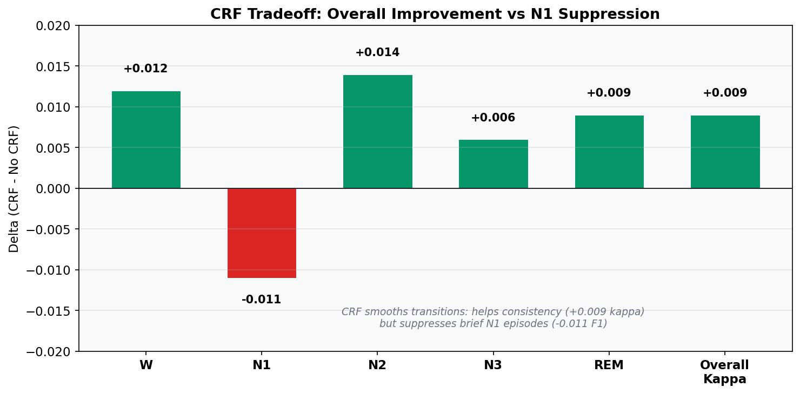
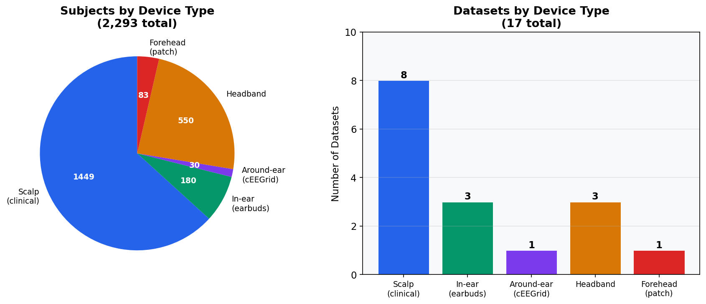
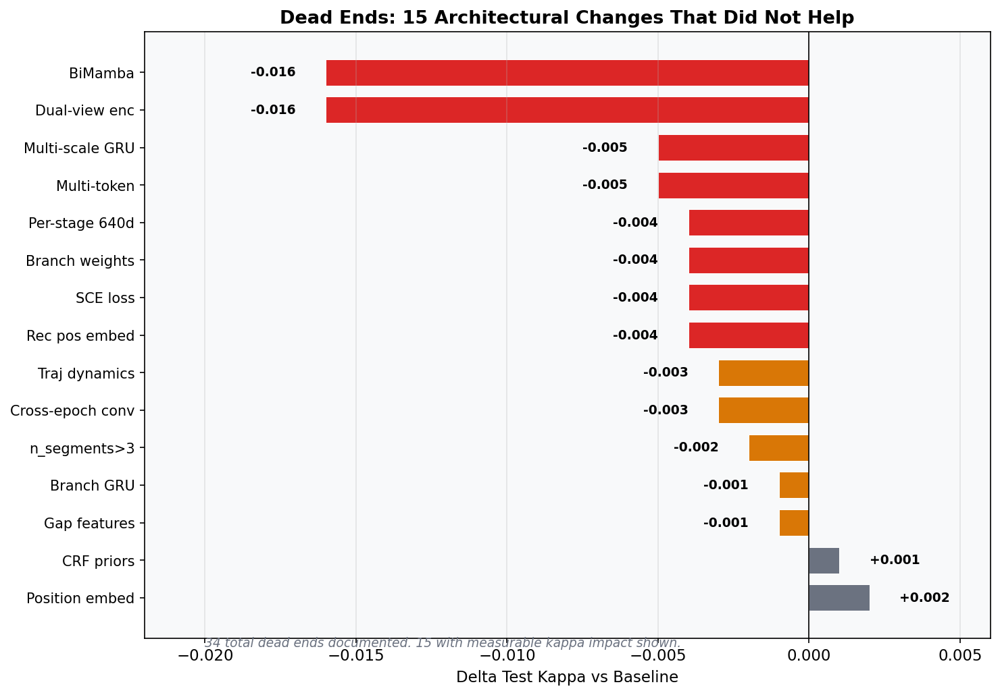

# EEG Sleep Stage Classifier

Device-agnostic single-channel EEG sleep staging at human expert-level agreement.

**Cohen's kappa: 0.765 | Macro F1: 0.777 | 17 datasets | 2,293 subjects | 5 device types**

Human inter-rater agreement: kappa 0.76 (95% CI 0.71-0.81). This system matches that ceiling from a single EEG channel across scalp, in-ear, around-ear, headband, and forehead devices.



## Quick Start

```bash
# Step 1: Preprocess raw data to HDF5
python data_pipeline.py

# Step 2: Train encoder (unsupervised, ~2 hours)
python train_encoder.py --exp-name v12

# Step 3: Train downstream classifier (~30 minutes)
python train_model.py --exp-name final --encoder-ckpt checkpoints/encoder/v12/epoch=49-val_loss=0.627.ckpt

# Step 4: Evaluate
python eval_per_dataset.py --exp-name final
```

## Architecture

Two-stage pipeline: unsupervised encoder (no labels) followed by frozen-encoder classifier.



**Encoder** (1.08M params): 5-branch feature extractor trained by reconstruction. Spectral (18 FFT features), STFT (patch transformer), and 3 CNN branches (small/medium/large kernel). All decoders discarded after training.

**Downstream** (4.2M trainable): Frozen spectral + STFT branches (256d, CNN branches skipped) feed a 2-layer BiGRU (hidden=384) with shared MLP head and linear-chain CRF. Sequences of 200 epochs (100 min).

Key finding: CNN branches encode device-specific waveform morphology. Dropping them from downstream improved cross-device generalization (+0.005 kappa, +0.025 N1 F1).

## Results

| Stage | F1 | Human kappa |
|-------|----|-------------|
| W | 0.932 | 0.70 |
| N1 | 0.535 | 0.24 |
| N2 | 0.820 | 0.57 |
| N3 | 0.753 | 0.57 |
| REM | 0.844 | 0.69 |



Cross-dataset comparison:

| Model | Kappa | Channels | Subjects |
|-------|-------|----------|----------|
| Stephansen (2020) | 0.67 | multi | 6,431 |
| ZleepAnlystNet (2024) | 0.78 | 1 | varies |
| **This work** | **0.77** | **1** | **2,293** |
| U-Sleep (2021) | 0.82 | multi | 15,660 |
| SOMNUS (2025) | 0.87 | multi | 27,494 |



### Information Flow

Layer-by-layer probing shows where stage discriminability emerges. The BiGRU jump (+0.185 kappa) is the single dominant contribution. Per-epoch features plateau at kappa 0.608.



### What Moved the Needle



### The CRF Tradeoff

CRF helps overall (+0.009 kappa) by smoothing transitions, but suppresses N1 -- the one stage that genuinely occurs as brief episodes.



## Data

17 publicly available datasets, 5 device categories:

| Device | Datasets | Subjects |
|--------|----------|----------|
| Scalp (clinical) | 8 | ~1,450 |
| In-ear (earbuds) | 3 | ~180 |
| Around-ear (cEEGrid) | 1 | ~30 |
| Headband | 3 | ~550 |
| Forehead (patch) | 1 | ~83 |

Preprocessing: resample to 128 Hz, bandpass 0.3-45 Hz, z-normalize per recording, cache as HDF5. Quality checks drop flat-line and extreme artifact epochs (0.29%).



## Project Structure

```
eeg_sleep/
  config.py              # Paths, constants, 17-dataset registry
  data_pipeline.py       # EDF/SET -> HDF5 preprocessing
  readers.py             # 10 dataset readers (BIDS + external)
  readers_extra.py       # 6 additional readers
  dataset.py             # PyTorch Dataset + Lightning DataModule
  model.py               # EpochEncoder + SleepStageNet + decoders
  train_encoder.py       # Unsupervised encoder training
  train_model.py         # Frozen encoder + BiGRU + CRF
  eval_embeddings.py     # Embedding quality metrics
  eval_per_dataset.py    # Per-dataset/device evaluation
  checkpoints/
    encoder/v12/         # Trained encoder
    sleep_model/final/   # Trained downstream
  plots/
    article/             # Article figures
```

## Tech Stack

| Component | Version | Purpose |
|-----------|---------|---------|
| Python | 3.11 | Runtime |
| PyTorch | 2.x | Model, training |
| Lightning | 2.x | Training loop, callbacks, logging |
| torchcrf | - | Linear-chain CRF |
| NumPy | - | Array operations |
| SciPy | - | Signal processing (bandpass, resampling) |
| h5py | - | HDF5 data caching |
| MNE | - | EDF/SET file reading |
| scikit-learn | - | kNN, metrics (kappa, F1, silhouette) |
| Rich | - | Progress bars |
| matplotlib | - | Visualization |

**Hardware**: RTX 5060 Ti (16GB), Ryzen 9 9950X3D, 64GB RAM. Single GPU, no distributed training.

**Training time**: Encoder ~2 hours, downstream ~30 minutes. Inference: full night (8h) in <2 seconds.

**Precision**: Encoder uses AMP fp16 + cudnn.benchmark. Downstream uses fp32 (CRF log-sum-exp overflows in fp16).

## Dead Ends

34 documented failed approaches. Notable:

- **BiMamba**: -0.016 kappa, 2.6x slower than BiGRU
- **EEG foundation models** (EEGPT, BIOT, BENDR, LaBraM, REVE): all worse with 5-200x more params
- **RevIN / InstanceNorm**: strips amplitude info, kappa ceiling 0.49
- **Focal loss / ArcFace / center loss**: consistently harmful
- **DANN**: z-normalized recon already domain-invariant
- **Attention pooling**: training collapse at epoch 12 (attention saturation)
- **F1 monitoring**: wash vs kappa monitoring

Full list in [CLAUDE.md](CLAUDE.md) under "Proven Dead Ends".



## Key Insights

1. **Temporal context is 89% of the improvement.** BiGRU + CRF added +0.185 kappa. Everything else combined: +0.015.
2. **Device-specific features hurt.** CNN branches learned waveform morphology that distinguished devices, not sleep stages. Removing them improved every device category.
3. **The evaluation framework is the ceiling.** All systems converge to human inter-rater agreement (~0.76 kappa) because that is what 5 discrete stages with single-scorer labels can support.
4. **Data diversity > data quantity.** 2,293 subjects across 5 device types closes most of the gap with U-Sleep's 15,660 subjects.

## License

Research use. Datasets are publicly available under their respective licenses.
